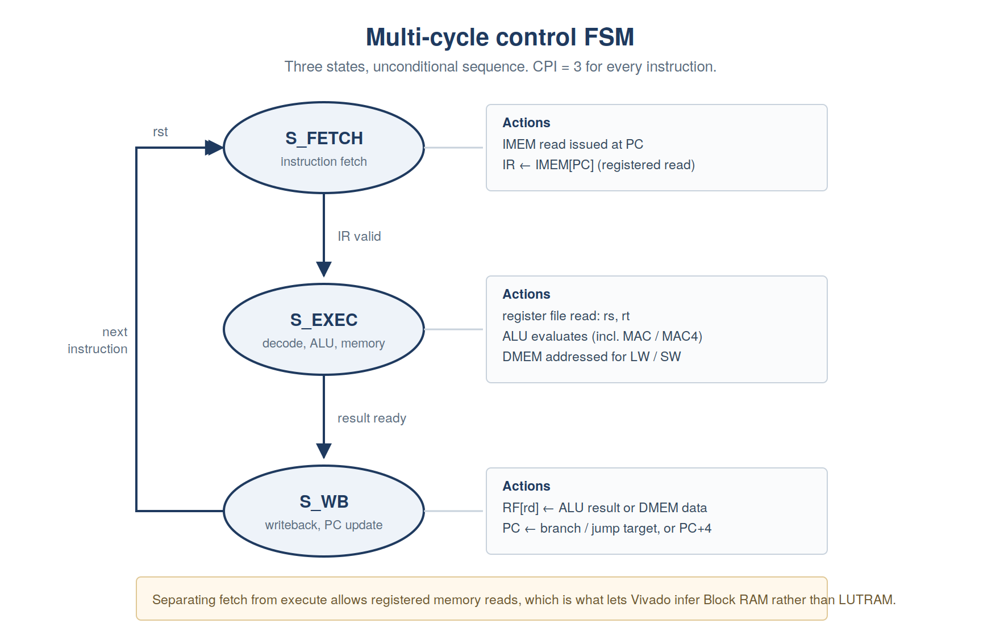
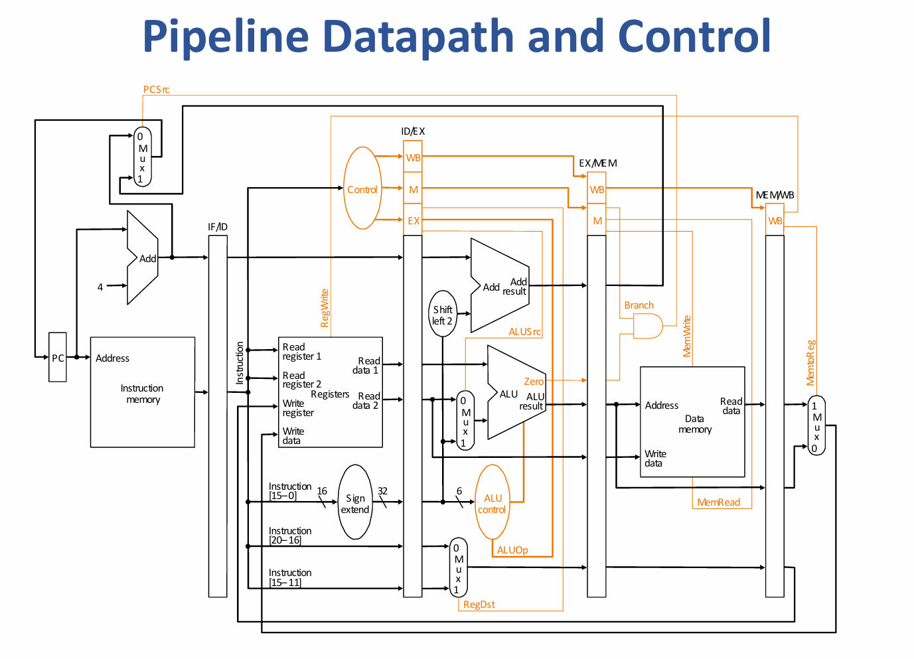

# Architecture

## Contents

- [Why multi-cycle](#why-multi-cycle)
- [State machine](#state-machine)
- [Datapath](#datapath)
- [Memory system](#memory-system)
- [Memory map](#memory-map)
- [Clocking](#clocking)
- [Build parameters](#build-parameters)

---

## Why multi-cycle

The first version of this processor was single-cycle: fetch, decode, execute and
writeback all resolved combinationally within one clock edge. That requires both
memories to answer *asynchronously* — the instruction word has to be available
in the same cycle the PC presents its address.

Vivado cannot map an asynchronous-read array to Block RAM, because BRAM
primitives register their read port. So it built the memories from distributed
LUTRAM plus a mux tree, and the arithmetic is unforgiving:

```
DataMemory declared reg [31:0] mem [0:131071]
  = (131072 / 64) x 32  =  65,536 RAM64X1S primitives
XC7S50 LUTRAM-capable LUTs   =  ~9,600
```

That single array accounts for the whole overflow. InstructionMemory was only
1,024 words and read-only, so it inferred as ROM and contributed almost nothing.
The reported requirement of 65,536 RAMS64E matches the calculation exactly — the
diagnosis was arithmetic, not inference.

Synthesis passed, because synthesis only estimates. Placement failed with seven
DRC resource errors, plus F7/F8 mux overflow on top.

Two things had to change: **depth** (the array was declared far larger than any
program needs) and **read style** (asynchronous → registered). Registered reads
need a cycle boundary between issuing an address and consuming the data, which
is precisely what a multi-cycle FSM provides for free.

## State machine



Three states, unconditional sequence, **CPI = 3 for every instruction**:

| State | What happens |
|---|---|
| `S_FETCH` | The instruction memory read is issued at the current PC. The BRAM output register captures the instruction word at the end of the cycle. |
| `S_EXEC` | The register file is read (`rs`, `rt`, `rd`), the ALU evaluates, and for `LW` / `SW` the data memory is addressed with `alu_result`. |
| `S_WB` | The register file write port commits, and the PC advances to the branch target, jump target or PC+4. |

CPI = 3 is flat and predictable, which is what makes the instruction-count
comparison between builds meaningful: 203,615 instructions × 3 = 610,845 cycles
= 12.22 ms at 50 MHz.

The obvious criticism is that most instructions do not need three cycles. That
is true, and the trade is discussed in the README's closing section — the short
version is that the alternatives either raise CPI further or need a clock this
design cannot reach with the MAC4 ALU in the path.

## Datapath



Structural summary:

- **ProgramCounter** — holds PC, updated only in `S_WB`. Sources: PC+4, branch
  target, jump target.
- **InstructionMemory** — registered-read BRAM. Its output register serves as
  the instruction register; there is no separate IR.
- **RegisterFile** — 32 × 32-bit, **three** asynchronous read ports, one
  synchronous write port. Written only in `S_WB`. Register 0 hardwired to zero.
- **ALU** — parameterised. Always present: ADD, SUB, AND, OR, XOR, SLL, SRL,
  SRA, NOT, RELU. Behind parameters: MAC, MAC4, MULT.
- **DataMemory** — registered-read BRAM holding the packed network. Its output
  register serves as the memory data register; there is no separate MDR.
- **ControlUnit** — the three-state FSM above, producing `pc_enable`,
  `reg_write`, `mem_write`, `imem_en`, `dmem_en` and the mux selects.

### Why three read ports

A stock MIPS R-type reads two registers. This one reads three, because `MAC` and
`MAC4` use `rd` as an accumulator *input* as well as the destination:

```verilog
result = rd + {{14{dot4[17]}}, dot4};   // MAC4
```

That is what makes the accumulate *fused* — one instruction rather than a
multiply into a temporary followed by an add. It is also the main structural
cost of the ASIP extension: a third 32:1 read mux sitting on the critical path.

**A note on the diagram.** If you are looking for the classic textbook
multi-cycle datapath with `IorD`, `IRWrite`, `ALUOut` and `A`/`B` temporaries —
this is not that machine. It has three states rather than ten, separate
instruction and data memories, and no explicit temporaries: the two BRAM output
registers do the job of IR and MDR. The similarity is in the idea (a state
machine sequencing a shared datapath), not the structure.

## Memory system

Both memories are inferred as true Block RAM. The conditions Vivado requires,
all of which this design meets:

1. The read must be registered — clocked into a flop on the same edge.
2. The array must be indexed by a bounded address, not a full 32-bit word.
3. No asynchronous reset on the output register.

Verify this after synthesis by checking that **LUT-as-memory is zero** and BRAM
tile count is non-zero (expect 33). If LUTRAM is non-zero, something reverted to
distributed memory and the design will not place.

### Why the network had to be packed

| | Size |
|---|---|
| Network, one INT8 value per 32-bit word | ~3,450 Kb |
| XC7S50 total BRAM | 2,700 Kb |

It did not fit — not marginally, structurally. Packing four INT8 values into
each 32-bit word reduced data memory from **110,390 words to 27,777 words**,
which fits comfortably in a 32,768-word array (33 BRAM tiles of 75).

The packing has a second benefit, which is the whole reason `MAC4` exists: four
weights arrive in one word, aligned with four activations in another, so a
single instruction can consume all four pairs. Unpacking them one at a time with
shifts would have thrown away most of the saving.

## Memory map

Data memory layout, word-addressed. Weights, biases and activations are grouped
**per layer**, not gathered by type:

| Region | Contents |
|---|---|
| Header | Layer dimensions, base addresses, row strides, requantisation shifts |
| Input | 784 INT8 pixel values, packed 4/word |
| Layer 1 | 784 × 128 weights packed 4/word; biases int32 at accumulator scale; 128 activations packed 4/word |
| Layer 2 | 128 × 64 weights; biases; 64 activations packed 4/word |
| Layer 3 | 64 × 10 weights; biases; 10 logits as unpacked int32 |
| Result | Argmax output word |

Layer 3's logits stay unpacked because they feed the argmax loop, not another
`MAC4`, and argmax is scale-invariant.

### Word addresses

```
header      0 ..    23     8 words per layer
image      24 ..   219     196 words, PACKED
L1 w      220 .. 25307     25088 words   b 25308..25435   y 25436..25467 (32 packed)
L2 w    25468 .. 27515      2048 words   b 27516..27579   y 27580..27595 (16 packed)
L3 w    27596 .. 27755       160 words   b 27756..27765   y 27766..27775 (10 int32)
result  27776
```

Total 27,777 words. The header for layer `l` starts at word `8*l`:

| Offset | Field | L1 | L2 | L3 |
|---|---|---|---|---|
| +0 | `n_in` | 784 | 128 | 64 |
| +1 | `n_out` | 128 | 64 | 10 |
| +2 | `x_base` | 24 | 25436 | 27580 |
| +3 | `w_base` | 220 | 25468 | 27596 |
| +4 | `b_base` | 25308 | 27516 | 27756 |
| +5 | `y_base` | 25436 | 27580 | 27766 |
| +6 | `w_row_stride` | 196 | 32 | 16 |
| +7 | `requant_shift` | 11 | 8 | 0 |

Layer `l+1`'s `x_base` equals layer `l`'s `y_base` — activations are written
once and read in place.

**Addressing is word-based, not byte-based.** `LW r5, 3(r10)` reads the word at
`r10 + 3`. This differs from stock MIPS and is the source of one of the more
time-consuming bugs in this project; see [debugging.md](debugging.md).

## Clocking

The board supplies 100 MHz. A single flop divides it by two, giving a 50 MHz
core clock:

```tcl
create_clock -period 10.000 -name sys_clk [get_ports clk]
create_generated_clock -name core_clk \
    -source [get_ports clk] -divide_by 2 [get_pins clk_div_reg/Q]
```

The `create_generated_clock` constraint *describes* the divider; it does not
configure it. Changing `-divide_by` without changing the RTL would make Vivado
analyse a clock that does not exist and the design would fail silently on
hardware.

At 50 MHz the MAC4 build closes at **WNS +0.029 ns**, TNS 0.000, WHS +0.034 ns,
with zero failing endpoints of 3,694 (post-route physopt). The baseline MAC
build, which has no MAC4 adder tree in the ALU, closes the same period at
**WNS +1.270 ns** over 3,632 endpoints.

**The two are not signed off under the same constraint, and it matters.** The
MAC4 build carries an explicit `set_clock_uncertainty 0.500 [get_clocks
core_clk]`; the baseline does not. Vivado reports total clock uncertainty of
0.535 ns on the MAC4 path (0.035 ns of jitter plus 0.500 ns user uncertainty)
against 0.035 ns on the baseline path. The 500 ps is deliberate pessimism
subtracted from the requirement before slack is computed.

| | Baseline MAC | MAC4 |
|---|---|---|
| Clock uncertainty | 0.035 ns | 0.535 ns |
| WNS as reported | +1.270 ns | +0.029 ns |
| WNS at equal uncertainty | +1.270 ns | ≈ +0.529 ns |

So the honest cost of the instruction is roughly **0.74 ns**, not 1.24 ns, and
the SIMD build has about **half a nanosecond** of real margin rather than
29 picoseconds. The +0.029 ns figure is a pass *on top of* half a nanosecond of
self-imposed pessimism, which is a considerably stronger result than it looks.
The corner Vivado signs off against also assumes worst-case process, 0.95 V and
85 °C, so a bench board at room temperature has headroom beyond even that.

The baseline should be rebuilt with the same uncertainty constraint before the
two slack numbers are quoted side by side.

### Case study: 45 MHz via MMCM

If margin is wanted rather than speed, the divider can be replaced with a
Clocking Wizard MMCM. Four changes, and the third is the one that bites.

1. **Instantiate the MMCM.** Clocking Wizard, 100 MHz in, one output at
   45 MHz. The wizard picks a VCO of 900 MHz (M = 9, D = 1) and divides by 20.
   900 MHz sits inside the XC7S50 `-1` VCO range, so no manual override is
   needed.

2. **Drive the core from `clk_out1`.** Delete the `clk_div` flop and the BUFG
   that followed it. The MMCM has its own global buffer on the output.

3. **Delete `create_generated_clock`.** This is the step that fails silently if
   skipped. `create_generated_clock` describes a divider that no longer exists;
   the Clocking Wizard emits its own constraints from the IP, and leaving the
   manual constraint in place means Vivado times the design against a clock the
   hardware does not produce. Timing closes, the bitstream builds, and the board
   computes nothing recognisable.

4. **Gate reset on `locked`.** An MMCM takes microseconds to lock, and its
   output is not a valid clock until it asserts `locked`. Hold the synchronous
   reset asserted until then:

   ```verilog
   wire rst_int = rst | ~locked;
   ```

   Without this the FSM begins fetching against an unlocked, wandering clock and
   the processor starts in an arbitrary state. This failure is intermittent,
   which makes it far worse than a failure that is total.

**What it costs.** 610,845 cycles at 45 MHz is **13.57 ms**, against 12.22 ms at
50 MHz — 11% slower for roughly 2 ns of extra slack, plus one MMCM of the five
on the device and a lock-time delay at power-on. Whether that is a good trade
depends on whether the board is a demo or a product. For this project it was
not taken: 50 MHz closed, and the divider is one flop with no lock semantics to
get wrong.

## Build parameters

```verilog
// MAC4 build (the program uses MAC4 exclusively)
ALU #(.ENABLE_MAC4(1), .ENABLE_MAC(0), .ENABLE_MULT(0)) alu (...);

// Baseline build (dnn_final_packed.asm, MAC with SRL lane-sliding)
ALU #(.ENABLE_MAC4(0), .ENABLE_MAC(1), .ENABLE_MULT(0)) alu (...);
```

All instruction arms sit in the same combinational case statement, so an
enabled-but-unused arm lengthens the critical path and widens the result mux on
**every** instruction. `ENABLE_MAC(0)` in the MAC4 build is not cosmetic: the
program issues zero plain `MAC` instructions, and the arm carried its own 32-bit
adder.

The two configurations fail in different places, which is more informative than
the slack numbers alone.

```
baseline (MAC), routed, WNS +1.270 ns
IMEM BRAM out -> register-file read mux -> ALU -> DMEM address port
17.804 ns, 19 logic levels (CARRY4=5, LUT2=3, LUT3=1, LUT4=1,
                            LUT5=2, LUT6=5, MUXF7=1, MUXF8=1)
logic 7.243 ns (40.7%), route 10.561 ns (59.3%)

MAC4, post-route physopt, WNS +0.029 ns
IMEM BRAM out -> register-file read mux -> ALU -> register-file write port
19.446 ns, 23 logic levels (CARRY4=11, LUT2=3, LUT3=1, LUT4=2,
                            LUT6=4, MUXF7=1, MUXF8=1)
logic 9.164 ns (47.1%), route 10.282 ns (52.9%)
```

Both begin at the instruction-memory BRAM output register — the shape of a
multi-cycle machine, where everything decode-dependent stacks behind a late
instruction word. Route delay dominates the baseline and is close to half in the
SIMD build.

The **endpoints** differ, and that is the result. The baseline's worst path ends
at the data-memory address port: `LW`/`SW` address arithmetic, with five CARRY4s
of address adder. The MAC4 build's worst path ends at the **register-file write
port** — the accumulator writeback — carrying eleven CARRY4s. Six extra levels
of carry logic terminating where `MAC4` deposits its result is the dot-product
tree and its 32-bit accumulate.

Rebalancing the tree from a three-deep chain to two levels bought back enough to
close at 50 MHz, but it did not move the bottleneck elsewhere: in this build
`MAC4` still defines the critical path.

Turn each parameter on only when the assembled program uses it. The area and
timing delta between configurations is a small but real ASIP result, and it is
recorded in [../results/benchmark.md](../results/benchmark.md).
